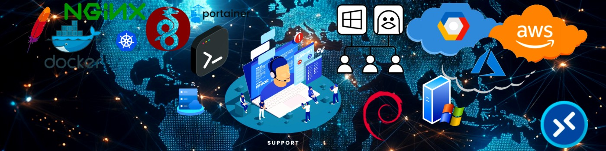

# Ismaeltech-sys

----------------

<h1 align="center">Hi 👋, Soy Ismael Pérez desde Andalucía</h1>

***

<h3 align="center">Un apasionado de los microservicios, Docker y las nuevas tecnologías</h3>

***

***

<h2 align="center">A continuación algunos de mis proyectos que puede que te sirvan</h2>

***

<h3 align="left">Más de 500 recursos relacionados con DevOps, Web Developers, Formación, Inteligencia Artificial, Productividad, Ciberseguridad, Protección de datos  y más tools o webs de interes que pueden servir de manera práctica en el día a día</h3>

- [https://recursos.ismaeltech.cc](https://recursos.ismaeltech.cc) 

 

***

 
<h3 align="left">IT-Tools. Una de las herramientas mas potentes para DevOps, en un solo sitio. Muy práctico.</h3>

- [https://it-tools.ismaeltech.cc](https://it-tools.ismaeltech.cc) 

- Del creador https://github.com/CorentinTh/it-tools

 

***

 
<h3 align="left">Omnitools. Kit de herramientas para el día a día. Utilidades útiles para la gestión de imágenes, textos o datos.</h3>

- [https://tools.ismaeltech.cc/](https://tools.ismaeltech.cc/) 

- Del creador https://github.com/iib0011/omni-tools

 

***

 
<h3 align="left">Enclosed. Para los casos que necesites enviar datos personales o notas de manera encriptada.</h3>

- [https://enclosed.ismaeltech.cc/](https://enclosed.ismaeltech.cc/) 

- Del creador https://github.com/CorentinTh/enclosed

 

***

 
<h3 align="left">Excalidraw. Potente herramienta para crear presentaciones. Importa tus librerías y a crear.</h3>

- [https://draw.ismaeltech.cc/](https://draw.ismaeltech.cc/) 

- Del creador https://github.com/excalidraw/excalidraw

 
 

***

<h3 align="center">🛠🧠Seguiré añadiendo más proyectos🧠🧰</h3>  

***

 
 
<h3 align="left">Lenguajes y Tools:</h3>

***

 

  
  
  
  
  
  
  
  
  
  
  
    
  
  
  
  
  
  
  
  

 

***

 

<h3 align="left">Conecta a través de:</h3>

***

 
 
- 🌱 Actualmente aprendiendo sobre las nuevas tecnologías, todo lo relacionado con el mundo DevOps y siempre formándome para formar parte de nuevos proyectos.
 
- 👨‍💻 Todos mis proyectos están disponibles en [Mi portal web](https://cv.ismaeltech.cc).
 
- 📄 Conoce mas sobre mi experiencia [Mi CV](https://cv.ismaeltech.cc).
 
- 📫 ¿Colaboramos?.

      hola@ismaeltech.cc  

      https://cv.ismaeltech.cc  

      https://www.linkedin.com/in/ismael-perez-moron/ 

 
 

---

Disponible para colaborar, crear y crecer en proyectos o ideas en las que pueda aportar mis conocimientos.
Gracias por visitar mi perfil.

---

 
 

 

***

***

 
 
<h3 align="left">Support:</h3>
 

 

***
